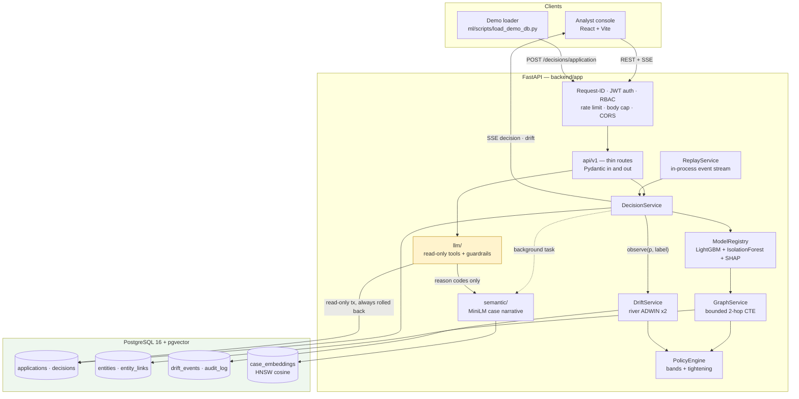

# SENTINEL — real-time fraud detection for digital lending

[](https://github.com/vinayakjeet/sentinel/actions/workflows/ci.yml)

A credit-card application arrives. SENTINEL scores it in under a second, explains the score in
language an applicant would understand, checks whether the applicant is connected to anyone already
known to be fraudulent, notices when the fraud pattern itself changes, and lets an analyst ask
questions about the case in plain English — without ever letting the language model touch the score.

Built for the Synchrony hackathon on the **Bank Account Fraud (BAF)** dataset (NeurIPS 2022),
1,000,000 real applications with a 1.1% fraud rate.

---

## 1. What it does

| | |
|---|---|
| **Scores** | LightGBM + IsolationForest blend (0.75 / 0.25) on 31 features → a 0–1000 score and one of four bands: APPROVE / STEP_UP / REVIEW / DECLINE. |
| **Explains** | Top-4 SHAP contributions per decision, mapped to plain-English reasons with an **ECOA category** each, plus an adverse-action notice endpoint. |
| **Connects** | Applications and their identifiers form a bipartite entity graph. A bounded 2-hop walk finds applications sharing a device, phone, IP, email or address, and raises the score when the neighbourhood contains confirmed fraud. |
| **Adapts** | ADWIN watches both the score stream and a delayed-label error stream. When the fraud pattern shifts, the decision bands tighten automatically and the change is written to an audit log. |
| **Answers** | An LLM copilot answers analyst questions using read-only tools. It cannot write a score, cannot invent a reason, and falls back to a templated answer when the provider is down. |
| **Finds precedent** | Each decision is embedded as a case narrative (MiniLM, pgvector HNSW); `/cases/{id}/similar` returns the five most similar past cases. |

### The invariant that shapes the whole design

> **The LLM layer has no write path to a risk score or a decision.**

Four independent barriers enforce it: the tool registry refuses any tool not marked read-only;
unknown tool names are refused; every tool call runs inside a Postgres `SET TRANSACTION READ ONLY`
transaction that is always rolled back; and the response model has no field a score could be
returned in. `test_llm_cannot_mutate_decision` is the first test in the suite.

---

## 2. Architecture



**Layering:** `api/v1` (thin routes) → `services/` (logic) → `repositories/` (all SQL) → `models/`
(ORM). Every route declares a Pydantic request *and* response model. Structured JSON logging carries
a `request_id` on every line and on every error response.

### Repository layout

```
backend/   FastAPI app, Alembic migrations, tests
  app/api/v1/       routes           app/services/      scoring, graph, drift, replay, policy
  app/repositories/ all SQL          app/semantic/      embeddings + similar cases
  app/models/       ORM              app/llm/           providers, prompts, guardrails, tools
  app/schemas/      Pydantic         app/core/          config, logging, security, limits, errors
ml/        featurize.py, train.py, fairness.py, artifacts/, scripts/, tests/
data/      raw/ (you supply), processed/, replay/      — gitignored
docs/      DESIGN.md, model-card, responsible-ai, aws-target-architecture, audit-R1, openapi.json
frontend/  React + Vite analyst console
```

---

## 3. Quickstart

**Prerequisites:** Docker + Docker Compose, Python 3.11+ (for the data/ML scripts), ~4 GB free disk.

```bash
git clone https://github.com/vinayakjeet/sentinel && cd sentinel
cp .env.example .env          # then fill it in — see below
```

`.env` needs, at minimum: `POSTGRES_USER`, `POSTGRES_PASSWORD`, `POSTGRES_DB`, `POSTGRES_HOST=localhost`,
`POSTGRES_PORT=5432`, `JWT_SECRET` (any long random string), and the four `DEMO_*` credentials.
`GROQ_API_KEY` is optional — without it the copilot serves templated answers instead of generated ones.
No secret has a default and none is committed; `.env` is gitignored.

### 3.1 Data and model artifacts

The trained artifacts in `ml/artifacts/` are committed, so **the API runs without re-training**.
To reproduce them, download [Bank Account Fraud](https://www.kaggle.com/datasets/sgpjesus/bank-account-fraud-dataset-neurips-2022)
and place `Base.csv` and `Variant II.csv` in `data/raw/`, then:

```bash
python -m venv .venv && .venv/bin/pip install -r ml/requirements.txt
python ml/scripts/prepare_data.py     # temporal split, 150k demo sample, identifiers, rings, replay streams
python ml/train.py                    # artifacts + metrics + charts
```

`data/replay/stream_base.csv` and `stream_shift.csv` are produced here and are what the live stream
replays — the API starts without them, but `/stream/start` will not.

### 3.2 Bring the stack up

```bash
docker compose up -d --build         # Postgres + pgvector, then the API
docker compose exec api alembic upgrade head
curl localhost:8000/ready            # {"status":"ready","database":"ok"}
```

API docs at **http://localhost:8000/docs**. Every route except `/health`, `/ready`, `/docs` and
`/api/v1/auth/login` requires `Authorization: Bearer <jwt>`:

```bash
TOKEN=$(curl -s localhost:8000/api/v1/auth/login \
  -H 'content-type: application/json' \
  -d '{"username":"YOUR_ANALYST_USER","password":"YOUR_ANALYST_PASSWORD"}' \
  | python -c 'import sys,json;print(json.load(sys.stdin)["access_token"])')

curl -s "localhost:8000/api/v1/decisions?limit=1" -H "Authorization: Bearer $TOKEN"
```

Tokens last 60 minutes. Analysts can read; the admin role additionally has
`/stream/start|stop|switch` and `/metrics/drift/reset`.

### 3.3 Load the demo database

```bash
python ml/scripts/load_demo_db.py --limit 40000 --rate 30 --workers 6
```

Every row goes through `POST /api/v1/decisions/application` — the same validation, scoring, entity
resolution and persistence a real application gets. A direct SQL load would be faster and would
prove nothing. The script prints latency percentiles, the band mix, what the entity graph did to
each planted ring, and writes three hero case IDs to `docs/demo_ids.json`.

It is **resumable**: `--resume` skips applications already in the database, so an interrupted load
never writes duplicate history rows.

---

## 4. The five-minute demo

1. **A decision, explained.** Open a hero case from `docs/demo_ids.json`. Score, band, four reasons
   in plain English with ECOA categories, latency. `GET /decisions/{id}/adverse-action` renders the
   notice a declined applicant would receive.
2. **The graph earns its keep.** Open `clean_looking_ring_member` — an application whose own
   features look ordinary. `GET /entities/{application_id}/graph` shows it sitting in a component
   with confirmed-fraud neighbours, and `graph_uplift` shows exactly how much of the score came from
   that, reported separately from the model's own probability.
3. **Drift.** `POST /stream/start`, watch decisions arrive over SSE, then `POST /stream/switch?source=shift`.
   Within about nine seconds ADWIN fires and the bands tighten from 300/650/850 to 225/575/775. The
   change lands in `drift_events` and `audit_log`; `GET /metrics/drift` shows before and after.
4. **Precedent.** `GET /cases/{decision_id}/similar` returns five past cases with similarity scores,
   found by embedding the case narrative — not by matching identifiers.
5. **Ask it something.** `POST /copilot/ask` — "why was this flagged?" Then try a prompt injection,
   and watch it refuse rather than comply.

---

## 5. How well does it actually work

Test set = months 6–7, 205,011 applications, 1.40% fraud. Temporal split throughout; the model never
sees a future row. These are the real numbers, including the ones that are not flattering.

| model | ROC-AUC | PR-AUC | Precision@100 | Recall @ 1% FPR |
|---|---|---|---|---|
| rules baseline | 0.685 | 0.024 | 0.04 | 0.002 |
| IsolationForest (unsupervised) | 0.586 | 0.020 | 0.06 | 0.024 |
| **LightGBM** | **0.876** | **0.167** | **0.55** | 0.227 |
| blend (0.75 / 0.25) — *what ships* | 0.873 | 0.160 | 0.48 | **0.230** |

**The blend is slightly worse than LightGBM alone on PR-AUC and Precision@100.** It ships anyway,
because the anomaly component is the only part that can react to a fraud pattern with no labelled
history, and it buys marginally better recall at a fixed 1% false-positive rate. That is a judgement
call, and it is written down rather than hidden behind a single headline number.

Of the top 100 riskiest applications, 55 are fraud (LightGBM) against a 1.4% base rate — a ~39×
lift where an analyst's time is actually spent.

### Fairness

`customer_age`, `employment_status` and `income` are **never model features** — a test fails the
build if one becomes a feature or a citable reason. They are carried for evaluation only.

| age group | n | fraud rate | approval rate | FPR @ DECLINE |
|---|---|---|---|---|
| ≤20 | 51,437 | 0.64% | 85.6% | 0.014% |
| 30–50 | 145,471 | 1.50% | 76.1% | 0.052% |
| ≥60 | 8,103 | 4.43% | 61.8% | 0.271% |

**This fails a four-fifths test: 61.8% / 85.6% = 0.72.** Applicants aged 60+ are approved at 72% of
the rate of the youngest group, below the 0.80 threshold. The underlying fraud rate in that group is
genuinely ~7× higher, so the disparity is not purely an artefact of the model — but "the data said
so" is not a defence for a real lending decision. `docs/responsible-ai.md` states what would have to
change before this scored a real applicant. BAF bands age by decade, so DESIGN's `<25 / 25–50 / >50`
buckets are mapped to `≤20 / 30–50 / ≥60`; that mapping is stated everywhere the numbers appear.

### The graph and similar-cases, measured on the loaded demo

From the 40,000-row demo load (`ml/scripts/load_demo_db.py`, `ml/scripts/verify_ring_similarity.py`):

| | |
|---|---|
| planted rings recovered | **4 / 4**, component sizes 21 / 24 / 19 / 15 |
| mean ring-member score, before → after graph uplift | 619–660 → **864–903** (+250 average) |
| mean score, ring members vs everyone else | **880.4** vs 367.2 |
| similar-cases: neighbours that were actually fraud (ring-member queries) | 41.9% (93/222) against a 9.6% base rate — but **that lift is the band, not the embedding**: neighbours are in the query's band 100% of the time, and a fraud-band case's neighbours are fraud-rich because the band is |
| similar-cases: mean-centering, same 41,858-row corpus, raw → centered | random-pair cosine mean 0.799 → 0.007 (std 0.084 → 0.358); top-1 minus top-5 similarity gap 0.005 → 0.027; neighbour fraud rate for fraud queries 40.9% → 41.7%; ring hits in top-5 4/225 → 3/225 |

Read those carefully. Raw MiniLM cosine was ~0.80 between *unrelated* narratives and ~0.99 between
neighbours, so a score of 0.99 meant nothing. Mean-centering (`embedding_mean_v1.json`) fixes the scale
— unrelated pairs now sit at ~0 — but it does **not** improve retrieval quality: similar-cases returns
cases in the same band with the same reasons, and adds no measurable fraud signal beyond the band. Use it as
"cases that read alike", show rank, band and reasons, and do not present the cosine as a probability.
Ring members mostly do **not** retrieve their own ring — correctly, because the narrative contains no
identifiers. Finding a ring is the entity graph's job; finding a lookalike is this one's.
`docs/audit-R1.md` §1b.6 has the full numbers, including the unflattering ones.

Full details: **`docs/model-card.md`**, **`docs/responsible-ai.md`**.

---

## 6. Disclosures — what in this demo is not real

Honest demos say which parts are staged. Three things here are.

### 6.1 Identifiers and fraud rings are synthetic

BAF contains no device IDs, emails, phones, IPs, addresses or names — it is fully anonymised. The
entity graph needs identifiers to link on, so `ml/scripts/prepare_data.py` **generates them
deterministically from the row index** (seeded, reproducible). They are not real people's data, and
they are not recovered from the dataset — they are invented.

On top of that, **four fraud rings of 8–15 applications are planted**, sharing a device ID and phone
number (and partly an IP). They are listed in the clear in `ml/artifacts/fraud_rings.json`:
`DEV-RING01`…`DEV-RING04`, sizes 13 / 15 / 9 / 8, spread across multiple months.

So the entity-graph capability is real — hashed entity resolution, a bounded 2-hop recursive CTE,
configurable uplift — but **the rings it discovers were put there on purpose**. What the demo
demonstrates is that the machinery finds them, not that BAF contains fraud rings.

Every identifier is sha256-hashed before storage (`entities.value_hash`); applicant names are stored
only as hashes; the graph API labels nodes by type and hash prefix, never by value; and synthetic IPs
are confined to RFC 1918 ranges so nothing resembles a routable address.

### 6.2 The demo database is a 40,000-row subset

`prepare_data.py` builds a 150,000-row stratified demo sample containing **every** fraud row plus
sampled legitimate rows. The loaded demo database is the **first 40,000** of those, plus all ring
members regardless of where they fall. Metrics in §5 come from the full 205,011-row test set, not
from this subset — the subset exists so the demo loads in under an hour, not to flatter the numbers.

### 6.3 The drift demo simulates a fraud wave

Switching the stream to `source=shift` replays **real rows from BAF Variant II** — a genuinely
different distribution from Base, which is what makes the drift real rather than noise injection.

But the fraud prevalence is raised: `REPLAY_SHIFT_FRAUD_RATE=0.12` means about **12% of replayed
rows are fraud**, against roughly 1% naturally. Those fraud rows are sampled **with replacement from
the variant file's own fraud rows**, so they are real applications, repeated — not fabricated ones.
Set `REPLAY_SHIFT_FRAUD_RATE=0` to replay Variant II exactly as it is.

Each replay pass also gets its own set of synthetic identifiers (device, email, phone, address, IP), so replayed applications never
link to the 40,000 loaded decisions, to the planted rings, or to an earlier pass over the same file. Without that, the stream
restarts at row 0 whenever the API restarts or the source is switched, every pass links to the last, and the live feed drifts
toward "everything is linked" (measured: 0.17 average graph uplift and 38% approvals, against about 0 and 75%).

Why: ADWIN on a realistic 1% wave needs tens of thousands of events to reach significance, which is
not a live demo. The detector, the delayed-label error stream, the tightening logic and the audit
trail are all unmodified — only the arrival rate of fraud is amplified.

Replayed rows are validated **without** `history`, so they can never set `fraud_flag` on an entity.
The simulated wave cannot manufacture confirmed-fraud graph signals.

---

## 7. API

18 routes, frozen in `docs/openapi.json`. Interactive docs at `/docs`.

| | |
|---|---|
| `POST /api/v1/auth/login` | → JWT (60 min). Rate limited to 10/min per IP. |
| `POST /api/v1/decisions/application` | Score and persist. The one write path. |
| `GET /api/v1/decisions`, `/decisions/{id}` | List and fetch, with reason codes and graph signals. |
| `GET /api/v1/decisions/{id}/adverse-action` | ECOA-shaped notice. 409 if the decision was not adverse. |
| `GET /api/v1/entities/{application_id}/graph` | Nodes and edges, bounded, identifiers hashed. |
| `GET /api/v1/stream` | SSE: `event: decision`, `event: drift`. Browsers cannot set headers on EventSource, so this route also accepts `?token=<jwt>`. |
| `POST /api/v1/stream/start\|stop\|switch` | **admin.** `switch?source=base\|shift`. |
| `GET /api/v1/metrics`, `/metrics/drift` | Latency percentiles, band mix; drift state and history. |
| `POST /api/v1/metrics/drift/reset` | **admin.** Restore base thresholds. |
| `GET /api/v1/cases/{decision_id}/similar?k=5` | Nearest past cases by narrative embedding. |
| `POST /api/v1/copilot/ask` | Analyst Q&A. Read-only tools, guardrailed, cannot change anything. |

**Security:** JWT bearer auth on everything but health and login; analyst/admin RBAC; per-user rate
limits (600/min default, 3000/min for scoring) falling back to per-IP for unauthenticated callers;
64 KB request body cap; CORS allowlist with credentials off; validation errors never echo submitted
values; unhandled errors return an opaque message plus a `request_id` to quote.

---

## 8. Tests and CI

```bash
ruff check backend ml
python -m pytest ml/tests -q
docker compose exec api python -m pytest tests -q       # needs Postgres
```

`.github/workflows/ci.yml` runs four jobs: **gitleaks** over full history; **ruff**; **backend tests**
against a `pgvector/pgvector:pg16` service container with migrations applied; and **ml tests** plus a
cold-interpreter load of every committed artifact. One CI step exists specifically to catch a failure
mode that would otherwise surface at runtime: it fails the build if the ML pins in
`backend/requirements.txt` drift from `ml/requirements.txt`, because the artifacts are pickled
against one set and unpickled against the other.

Secret scanning is clean: gitleaks 8.30.1 over all commits in history, no leaks found.

---

## 9. Known limitations

- **The fairness result is a fail, not a caveat.** See §5 and `docs/responsible-ai.md`.
- **Identifiers and rings are synthetic** (§6.1). The graph machinery is real; the rings are planted.
- **Latency depends entirely on load, so both numbers are quoted.** A single request on an idle
  stack takes **p50 38 ms / p95 41 ms**, comfortably inside DESIGN §11's 200 ms budget. Under the
  six-worker bulk load the same stack measures **p50 279 ms / p95 450 ms / p99 577 ms** — queueing
  on one developer machine, not a slow scoring path. Method and both runs: `docs/audit-R1.md` §1b.5.
- **One machine, one process.** No horizontal scaling, no model registry, no feature store, no
  retraining pipeline. `docs/aws-target-architecture.md` describes the production shape and is honest
  about which parts are not free.
- **Labels are simulated.** `history=true` rows carry BAF's `fraud_bool` to seed confirmed fraud.
  Live traffic never sets it, because in production that label arrives weeks later as a chargeback.
- **The copilot fails closed.** Questions phrased like instructions ("what would change the score?")
  are refused by the injection guardrail. Loosening a security control late costs more than a rephrase.

---

## 10. Documentation

| | |
|---|---|
| `DESIGN.md` | Full technical design and contracts. |
| `docs/model-card.md` | Data, features, exclusions, metrics, fairness, limitations. |
| `docs/responsible-ai.md` | Protected attributes, the fairness failure, human oversight, data handling. |
| `docs/aws-target-architecture.md` | Production architecture on AWS, with the hard parts named. |
| `docs/audit-R1.md` | Independent audit against the eight project invariants, plus the A4–A6 re-audit. |
| `docs/openapi.json` | Frozen API contract. |

Built on the [Bank Account Fraud dataset](https://github.com/feedzai/bank-account-fraud)
(Jesus et al., NeurIPS 2022), used under its research licence.
