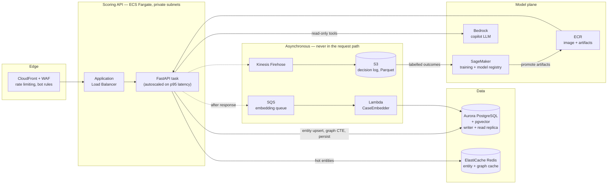
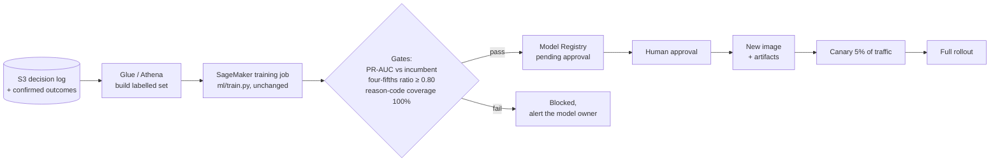

# Target architecture on AWS

What SENTINEL looks like in production. The submission runs on Docker Compose on one machine
(DESIGN §14 puts cloud deployment out of scope); this is the shape it is built to grow into, and
the places where that growth is not free.

The design principle throughout: **the scoring path is synchronous and must stay inside 200 ms at
p99; everything that does not change the answer is asynchronous.**

---

## 1. Scoring path

## 2. Component mapping

| Today (compose) | On AWS | Why |
|---|---|---|
| `api` container | **ECS Fargate** behind an ALB, private subnets | No hosts to patch; scales on p95 latency, which is the SLO that matters |
| `pgvector/pgvector:pg16` | **Aurora PostgreSQL** with `pgvector` | The 2-hop graph CTE and the HNSW vector index are both just Postgres; Aurora adds replicas and backups without a rewrite |
| artifacts on a mounted volume | **ECR image layer** + **SageMaker Model Registry** | The artifacts are a contract (DESIGN §4). Baking them into the image makes the model version and the code version one deployable thing |
| in-process replay stream | **Kinesis Data Streams** | DESIGN §14 scoped Kafka out; the in-process stream is the same interface with one consumer |
| in-process ADWIN | ADWIN in the consumer, state in **DynamoDB** | Drift state must survive a task restart, which an in-process detector does not |
| background embedding task | **SQS → Lambda** | Embedding is ~50 ms of model time that must never be inside the 200 ms budget |
| Groq | **Bedrock** | `LLMProvider` already abstracts this — `BedrockProvider` is a stub with the interface in place, so the swap is one class |
| `.env` | **Secrets Manager** + Parameter Store | Invariant 3 already forbids secrets in code; this is the same rule with rotation |
| JSON logs to stdout | **CloudWatch Logs** + Firehose → S3 | `request_id` is already on every line, so tracing works the moment logs land centrally |

## 3. Latency budget

DESIGN §11 budgets p99 < 200 ms. Aurora replaces a local Postgres, so the database steps get more
expensive and the async steps leave the path entirely:

| step | local | on AWS | note |
|---|---|---|---|
| validation | 2 ms | 2 ms | Pydantic, unchanged |
| entity upsert | 15 ms | 10 ms | Redis absorbs the hot entities |
| 2-hop graph CTE | 40 ms | 45 ms | bounded to 200 nodes; the main latency risk |
| model + IsolationForest | 10 ms | 10 ms | in-process, no inference endpoint — a network hop here would cost more than the model |
| SHAP top-4 | 20 ms | 20 ms | TreeExplainer built once at startup |
| policy | 1 ms | 1 ms | |
| persist | 15 ms | 20 ms | writer endpoint |
| embed | async | async | SQS, off the path |
| **total** | **~103 ms** | **~108 ms** | headroom against the 200 ms p99 target |

The model runs **in the API task, not on a SageMaker endpoint**. A managed endpoint adds a network
round trip to a 10 ms computation, and SHAP needs the model object locally anyway. SageMaker is used
for training and the registry, not for serving.

## 4. Retraining

Labels arrive late — that is why DESIGN §7 has a delayed-label path with a configurable lag. The
retraining set is therefore always a trailing window, and the temporal-split rule (DESIGN §2, never
random) applies to every retrain exactly as it applies today.

**The fairness gate is not decoration.** `docs/responsible-ai.md` §4 records that the current model
has an approval-rate ratio of 0.721 against a 0.80 target. Under this pipeline that model would be
**blocked at the gate**. That is the correct behaviour, and it is the main reason the gate exists.

## 5. Security

* Private subnets only; no public IP on any task or database. Ingress is CloudFront → WAF → ALB.
* IAM task roles scoped per service: the embedding Lambda can write `case_embeddings` and read
  `decisions`, and nothing else.
* The copilot's read-only guarantee (`docs/responsible-ai.md` §5) gets a second, infrastructural
  layer here: its database credential is a **distinct Secrets Manager secret for a Postgres role
  with `SELECT` only**. The application-level `SET TRANSACTION READ ONLY` stays as defence in depth;
  a grant is the thing an attacker cannot talk their way past.
* Secrets in Secrets Manager with rotation. gitleaks runs in CI (`.github/workflows/ci.yml`) and as
  a pre-commit hook, so a secret should never reach the repository to begin with.
* KMS encryption at rest for Aurora, S3 and SQS; TLS everywhere in transit.
* CloudTrail for the audit trail, alongside the application's own `audit_log` table.

## 6. Cost shape

Driven by Aurora and Fargate, not by inference — the model is 1.2 MB of trees running in-process.
The two costs worth watching:

1. **The 2-hop CTE** is the most expensive query in the system, so read-replica sizing follows graph
   traffic rather than scoring traffic.
2. **Embedding** is the only GPU-shaped workload, and it is Lambda-on-CPU with MiniLM (384-dim,
   ~90 MB). If case volume made that expensive, batching on the SQS consumer is the first lever;
   a GPU endpoint is not warranted at this model size.

## 7. Honest gaps

This is a target, not a deployment. Not built, and not claimed to be:

* No Terraform or CDK in this repository. The diagram is a design, not applied infrastructure.
* Multi-region and DR are not designed. Aurora and S3 support it; the RTO/RPO conversation has not
  been had.
* Load testing has not been done at production volume. The latency table combines measured local
  numbers with estimates for the AWS hops, and the estimates are marked as such.
* `BedrockProvider` is an interface stub that raises. The swap is one class, but it is one class
  that has not been written.
